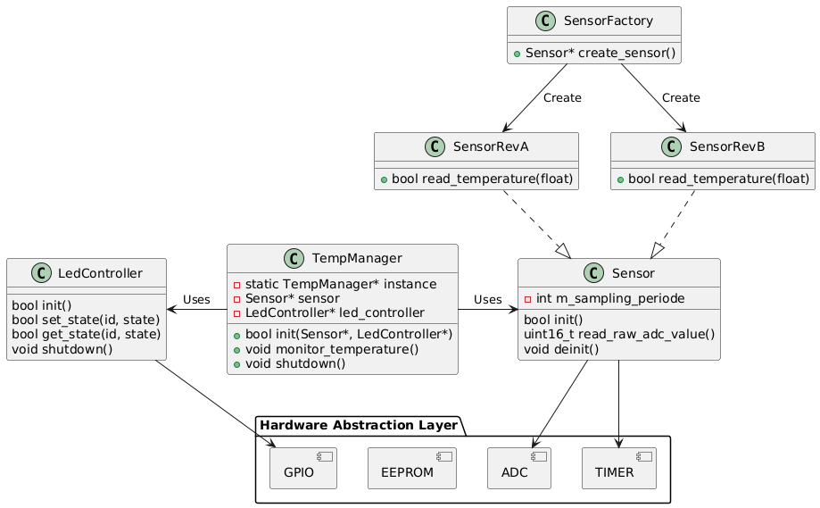
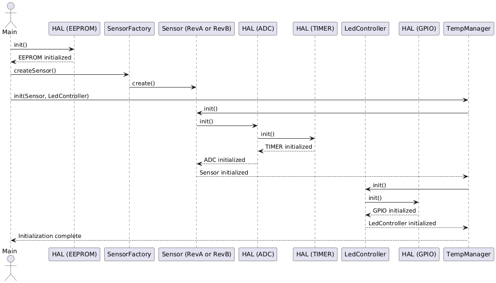
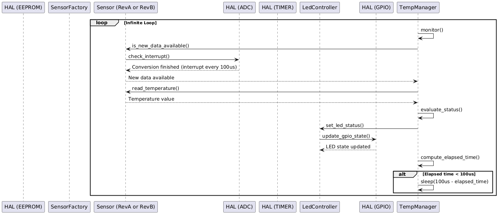

= Temp Monitor Project Documentation
Mohamed Msadaa <mohamed.msadaa.ensi@gmail.com>
2025-01-27

== Overview
The **Temp Monitor** project is designed for monitoring temperature sensor, support multiple revisions and controlling LEDs based on temperature status. It integrates multiple components, including a hardware abstraction layer (HAL), temperature sensor, LED controller, and a monitoring system.

== Components
- **Sensor**: Measures temperature.
- **SensorFactory**: Create Sensor based on hardware revision.
- **LedController**: Manages LED states based on the temperature data.
- **TempManager**: Coordinates between the sensor and LED controller.
- **HAL**: Abstracts hardware interactions.

== Initialization Sequence

== Monitoring Sequence

== Design Choices
To keep jitter very low and CPU load low a mix of hardware timer and synchronization mechanism is designed 
A timer of 100us is configured to start ADC conversion and thus recieving an interruption to read raw value
Meanwhile the main loop will first wait for first ADC value reading then fron that point onwards it make sure to read and evaluate the temperature then execute whatever other functionality there is compute elapsed time and sleep until a full 100us has elapsed